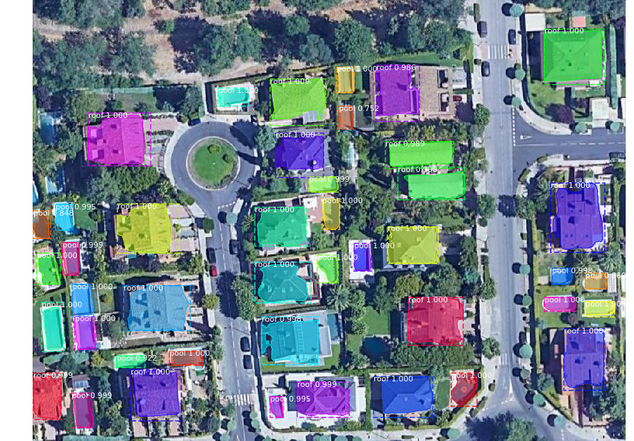

# Madrid_Rooftops

A [Mask R-CNN](https://arxiv.org/abs/1703.06870) project for Madrid Rooftops Image Segmentation

Enlaces con información ampliada: [Informe](Madrid%20Rooftop%20Segmentation%20-%20Resume.pdf) / [Presentación](Madrid%20Rooftops%20Segmentation%20-%20Presentacion.pdf)

Ana Blanco Delgado | Septiembre de 2021

---

Este proyecto lo he realizado para el Bootcamp de Data Science en The Bridge en septiembre de 2021, como trabajo individual de Machine Learning. Mi background relacionado con la imagen y el vídeo me ha arrastrado a tareas de Computer Vision, y la idea de este proyecto me aterrizó tras escuchar un muy interesante podcast de Data Stand-Up! con el entrevistado David Rey (Chief Data Officer en Idealista). En la entrevista se menciona el proyecto de Idealista Energy que ofrece información sobre los tejados y su posible aprovechamiento para la instalación de paneles solares (área del tejado, número de paneles solares a instalar, coste aproximado de su instalación, cálculo de ahorro posterior en el consumo energético...).

El objetivo del proyecto es acercarme a este servicio de Idealista Energy y detectar tejados residenciales, piscinas y áreas deportivas, en imágenes aéreas de la Comunidad de Madrid. Para ello he utilizado el framework Mask R-CNN (Mask Region Convolutional Neural Network) para la detección, clasificación y segmentación de imágenes. El framework elegido nos permite hacer segmentación de la imagen para seleccionar el área del tejado por su forma lo que nos podría permitir calcular el área de la máscara predicha. Además, esta implementación de Mask R-CNN parte de una red ResNet101 preentrenada con el dataset de imágenes MS COCO.

### Dataset
He descargado 91 imágenes de Google Maps con un zoom fijo de 19, y las he etiquetado con el software [VGG Imagen Annotator (VIA)](https://www.robots.ox.ac.uk/~vgg/software/via/) que permite seleccionar instancias con polígonos y asignarles una clase. El número final de polígonos etiquetados para las 91 imágenes fue de 2.033.

Para ver información más detallada sobre el dataset revisar el notebook: [/notebooks/inspect_data.ipynb](/notebooks/inspect_data.ipynb)

### Entrenamiento
Una vez heredadas las clases necesarias para cargar el dataset y configurar el modelo según especificaciones de Mask R-CNN, entrené las 69 imágenes con sus 1.488 máscaras durante 80 epochs. Evalué con el Mean Average Precision (mAP@IoU=50) cada epoch resultando el módelo del epoch 60 el mejor con los siguientes valores:

Evaluación modelo epoch 60:
- **`Train_set mAP@50: 0.720`**
- **`Val_set   mAP@50: 0.527`**

Estos valores sugieren seguir entrenando el modelo, posiblemente con un dataset mayor. 

Para ver información más detallada sobre el modelo seleccionado revisar el notebook: [/notebooks/inspect_model.ipynb](/notebooks/inspect_model.ipynb)

Para comprender mejor los resultados revisé las predicciones del modelo con el dataset de validación porque tenía la intuición de que el modelo tiene un buen desempeño para la segmentación de residencias aisladas pero no de adosados o edificios. A continuación muestro ambos casos:

### Ejemplo de predicción y evaluación en imagen con edificios 
(imagen del dataset de validación: pozuelo 2021-09-13 200628.png)

 Predicciones | AUC-PR - AR@IoU=50
 :------------|---------------:
  | 

### Ejemplo de predicción y evaluación en imagen con casas o chalets 
(imagen del dataset de validación: pozuelo 2021-09-13 200628.png)

 Predicciones | AUC-PR - AR@IoU=50
 :------------|---------------:
  | 
 
Así podemos concluir que el modelo consigue unos buenos resultados con imágenes:
- En zonas de viviendas residenciales aisladas (casas y chalets)
- Y un número de instancias no muy superior a 20

## Fuentes y recursos
- Mask R-CNN paper oficial: https://arxiv.org/abs/1703.06870
- Mask R-CNN for Object Detection and Segmentation (repositorio open-source de Matterplot): https://github.com/matterport/Mask_RCNN-
- Splash of Color: Instance Segmentation with Mask R-CNN and TensorFlow: https://engineering.matterport.com/splash-of-color-instance-segmentation-with-mask-r-cnn-and-tensorflow-7c761e238b46
- Podcast Data Stand-Up! Episodio 6, con David Rey (Chief Data Officer - Idealista): https://www.spreaker.com/user/bedr0o/david-rey-chief-data-officer-idealista
- How to Train an Object Detection Model with Keras: https://machinelearningmastery.com/how-to-train-an-object-detection-model-with-keras/
- VGG Image Annotator (VIA): https://www.robots.ox.ac.uk/~vgg/software/via/
- Map Puzzle: http://www.mappuzzle.se/
- Google Colab: https://research.google.com/colaboratory/
- Paneles solares para tu casa. Autoconsumo solar fotovoltáico: https://www.idealista.com/energy/
- Object Detection Metrics With Worked Example: https://towardsdatascience.com/on-object-detection-metrics-with-worked-example-216f173ed31e
- Taming the Hyper-Parameters of Mask RCNN: https://medium.com/analytics-vidhya/taming-the-hyper-parameters-of-mask-rcnn-3742cb3f0e1b
- Project Zeus, or How to Detect Rooftops using Neural Networks. A Begginer’s Guide: https://alexwhelan.medium.com/project-zeus-or-how-to-detect-rooftops-using-neural-networks-a-beginners-guide-a8efed8da28a

